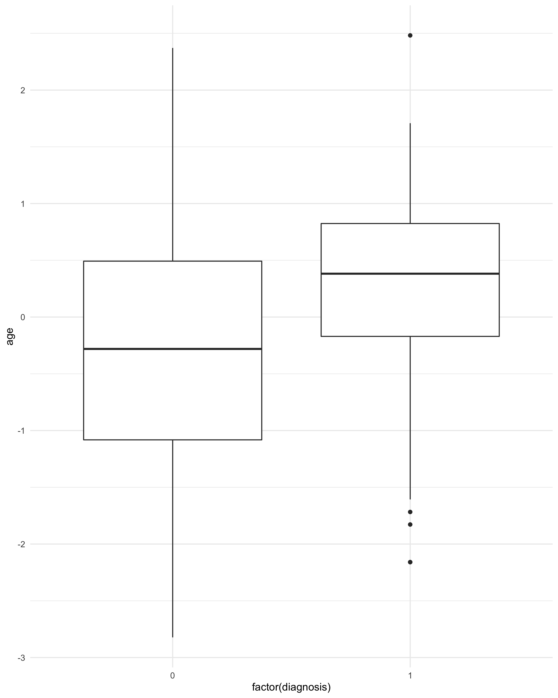
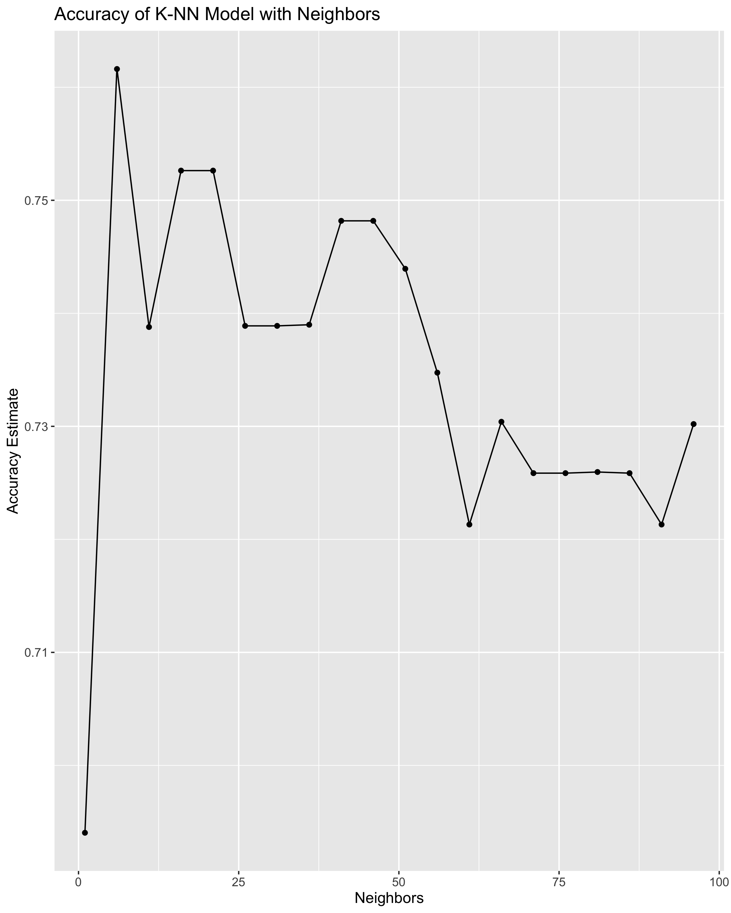
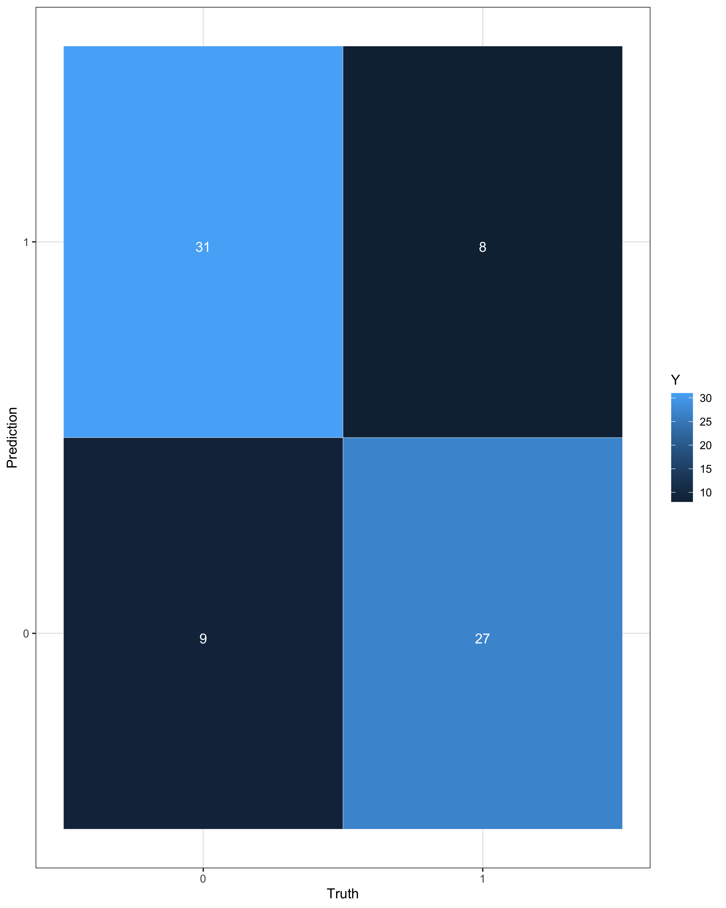

```{r library-setup, include=FALSE}
knitr::opts_chunk$set(echo = FALSE, warning = FALSE, message=FALSE)
library(tidyverse)
library(tidymodels)
library(ggplot2)
library(GGally)
library(rlang)
setwd("..")
```

```{r source-setup, include=FALSE}
source("../R/clean_data.r")
source("../R/accuracy_plot.r")
source("../R/diagnosis.r")
source("../R/balance_check.r")
set.seed(4)
```


# Introduction
Heart disease is an umbrella term that refers to several conditions that affect the health of one's heart. Common heart diseases include disease of the blood vessel, arrhythmia (irregular beating of the heart), disease of the heart valve and muscle, infection of the heart, and heart defects from birth [@medical_education_mayo]. The symptoms of one’s heart disease is very dependent on the type of disease they have, however many forms can be prevented with healthy lifestyle choices. Most heart diseases (with the exception of serious defects at birth) are only diagnosed after a heart attack, heart failure, or stroke [@medical_education_mayo]. Heart attacks, heart failure, and strokes are very traumatic events to go through and are oftentimes deadly [@disease_control_centers]. Therefore it is very important that we are able to predict if an individual is at an increased risk of heart disease and try to get them preventable care. In this project we want to determine if we can predict if someone is at risk of a heart disease based on the following variables.

We used data from UCI Machine Learning (https://archive-beta.ics.uci.edu/ml/datasets/heart+disease). The Cleveland Heart Disease dataset consists of 13 explanatory variables and 1 target class. The variables, variable type and a brief description of each variable are listed below in table \@ref(tab:variable-table).

```{r variable-table, echo = FALSE, message = FALSE}
variables_table <- read_csv("../data/variables.csv")
knitr::kable(variables_table, caption = "Desciptions of Variables")
```

# Methods & Results
We started by loading the heart disease data set and adding a column headers. The database has 14 features. For the purpose of this analysis, we have focused on the Diagnosis feature. Based on the data description, any value over 0 has a heart disease and 0 indicates no presence of heart disease.

Before any data analysis can be done, the data needs to be cleaned. The downloaded data does not have any column names so first we need to add all the variables to their respective column. The next step in cleaning up the data is to check for missing values. It is important that we remove these before any data analysis so that the functions we use will run on the data properly. Instead of R recognizing our missing values, we have a question marks. We need to convert this to an actual NA that R will recognize. Thus to clean the data we have used our custom clean function. Additionally since this project should be in the scope of DSCI 100 and we did not learn how to use one hot encoding to deal with categorical variables, we will drop all the categorical variables from our dataset.

One thing to note is that our target class (diagnosis) has values from 0 to 4 where 0 means that heart disease was not present and 1-4 indicate increasing severity of the heart disease. For this analysis we will combine all instances where heart disease was present and represent that with a value of 1. We will do this with our custom diagnosis function. This function finds all instances of heart disease (1-4) and replaces them with the number 1 to indicate the presence of heart disease in a patient. Table \@ref(tab:heart--disease-table) shows a sample of our cleaned data.

```{r heart--disease-table, echo=FALSE, message=FALSE, out.width="80%"}
heart_disease <- read.csv("../data/processed/full.csv", header = TRUE)
knitr::kable(head(heart_disease), caption = "Clean Heart Disease Dataset")
``` 

## Exploring Dataset
Next we need to get to know our data. We will do this by performing exploratory analysis where we summarize our data and graph a few relevant figures. The aim of doing this is to get a better understanding of what our final classification analysis will look like.


````{r attribute-box, echo=FALSE, out.width="40%", fig.cap="Age vs Heart Disease Diagnosis."}

````


Through figure \@ref(fig:attribute-box) we can see that the most common age to have a heart disease ranges from 55 to 60 and looking at the outliers

We grouped the data by its diagnosis and graphed it in order for us to see if the dataset is balanced or not. In table \@ref(tab:balance-table) we can see that the data is fairly evenly balanced between no diagnosis and detection of heart diseases. This is further shown in figure \@ref(fig:pie-distribution)

```{r balance-table, echo=FALSE, message=FALSE, out.width="80%"}
heart_disease_table <- balance_check(heart_disease, diagnosis)
knitr::kable(heart_disease_table, caption = "Balance of Diagnosis in Dataset")
```


```{r pie-distribution, echo=FALSE, out.width = "40%", fig.cap="Distribution of Diagnosis"}

```


```{r correlation, echo=FALSE, out.width = "40%", fig.cap="Correlation between Variables"}

```

In figure \@ref(fig:correlation) we can see that most variables look like they have some correlation save for serum_cholesterol and max_heart_rate. While the correlations may not look very high, this is actually a good sign because highly correlated variables can lead to overly complicated models.

## Classification Analysis
Now that we have done our exploratory analysis we can begin training our classification model. To do this we need to split our data. We do this so that after we create our model we can find the accuracy of our classifier.

```{r split-data}
# split into training and test data sets
data_train <- read.csv("../data/processed/training.csv", header = TRUE)
data_test <- read.csv("../data/processed/test.csv", header = TRUE)

```

Next we perform cross validation for our data. This is important because it allows us to get a more accurate idea of how our classifier is doing. If we did not use cross validation our classifier might be biased from an unbalanced validation set without us knowing. We preprocess the data by creating a recipe. This step allows us to standardize our predictors so that any one predictor is not disproportionately affecting the classifier even if it has a larger number.

Next we create our classifier. The only parameter we can tune is the number of classifier we have. We are tuning our classifier to get the optimal number of neighbors as to increase accuracy.


```{r accuracy-plot, echo=FALSE, out.width = "40%", fig.cap="Accuracy of K-NN Model with Neighbors"}

```

From figure \@ref(fig:accuracy-plot) we can see that our accuracy peaks at around 12-13 neighbors. Therefore we will use that in our new classifier that we will use to predict."

```{r confusion-matrix, echo=FALSE, out.width = "40%", fig.cap="Confusion Matrix of Results"}

```

The confusion matrix in figure \@ref(fig:confusion-matrix) shows us that a majority of the predictions were given the right label. However we also see that the model is more likely to predict a false negative than a false positive.

# Discussion
In this project, we used 13 attributes to predict whether a person has heart disease or not. Many contributing factors can be considered for this prediction. Age is one of them. Based on our results, we saw that heart disease is more common among people between 55 to 60 years old. This aligns with our expectation that most heart disease diagnosis is in middle-aged people. We also saw that the other explanatory variables (resting_blood_pressure, serum_cholesterol, max_heart_rate, oldpeak, and num_of_major_vessels) can also be used to train a classification model and predict heart disease in people. We used the K-nearest neighbors algorithm for our classification. This is a simple and intuitive algorithm that works perfectly with our two-class classification problem. However we found that our accuracy was low (73%). This could be due to us dropping many categorical variables. Variables such as if the patient had chest pain, angina, or thalessemia could be very important in determining if they get heart disease [@Heart_condition_mayo]. Thus we might have seen higher accuracy if we were able to use these variables.

In future studies, we could use more complex methods to increase the accuracy of our model. Predicting heart disease is remarkably useful for heart disease awareness. Early heart disease detection can be crucial for the treatment process and can save lives. Following our predictions, one can be advised to do checkups and detect early signs of heart diseases and start the treatment early [@early_detection].

For future studies, one can study the difference between the contribution of these factors in heart disease detection. Our prediction model predicts more false negatives than false positives. This is not good because the prediction may suggest one has no heart disease who in fact has the disease. Therefore, in further studies, we can focus on building a more accurate model and decrease our amounts of false negatives. Having false positives, on the other hand, is not crucial to be taken care of since one may be a person prone to heart disease and can be advised to be more cautious and do more regular checkups. In this study, we focused on the numerical variables. For more accurate predictions, one can consider those categorical variables contributing to the presence of heart disease which can lead to a more reliable prediction.


# References
